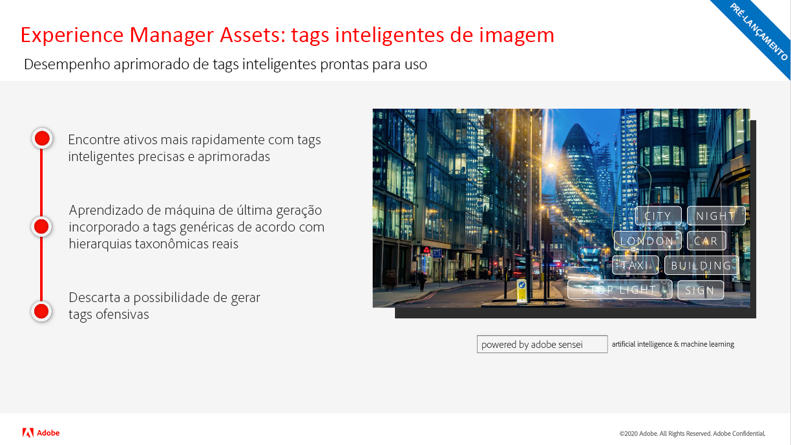

# Atualizações da versão do Adobe Experience Manager as a Cloud Service

Obtenha uma visão geral rápida dos recursos mais recentes no Adobe Experience Manager as a Cloud Service. São vídeos curtos, de aproximadamente 10 minutos, disponibilizados pela equipe de produtos AEM que compartilham os destaques da versão mais recente.

## Última atualização

<table style="max-width: 50%;">
  <tr>
    <td>
      
      

        <a href="./2022/2022-10-0.md">
 <strong>Versão | 2022.10.0</strong>
  
 </a>
 <em>Data de lançamento: 13 de outubro de 2022 </em>
      

      

        <a href="https://experienceleague.adobe.com/docs/experience-manager-cloud-service/content/release-notes/release-notes/release-notes-current.html?lang=pt-BR">Notas de versão</a>
      

    </td>
  </tr>  
</table>

## Atualizações anteriores

<table style="max-width: 50%;">
  <tr>
    <td>
      
      

        <a href="./2022/2022-8-0.md">
          <strong>Versão | 2022.8.0</strong>
           
        </a>
          <em>Data de lançamento: 1 de setembro de 2022 </em>
      

      

        <a href="https://experienceleague.adobe.com/docs/experience-manager-cloud-service/content/release-notes/release-notes/release-notes-current.html?lang=pt-BR">Notas de versão</a>
      

    </td>
    <td>
      
      

        <a href="./2022/2022-7-0.md">
          <strong>Release | 2022.7.0</strong>
           
        </a>
          <em>Release date Aug 8, 2022 </em>
      

      

        <a href="https://experienceleague.adobe.com/docs/experience-manager-cloud-service/content/release-notes/release-notes/release-notes-current.html?lang=pt-BR">Notas de versão</a>
      

    </td>
    <td>
      
      

        <a href="./2022/2022-6-0.md">
          <strong>Versão | 2022.6.0</strong>
         
      </a>
        <em>Data de lançamento: 30 de junho de 2022 </em>
      

      

        <a href="https://experienceleague.adobe.com/docs/experience-manager-cloud-service/content/release-notes/release-notes/release-notes-current.html?lang=pt-BR">Notas de versão</a>
      

    </td>
  </tr>
  <tr>  
    <td>
      
      

        <a href="./2022/2022-5-0.md">
          <strong>Versão | 2022.5.0</strong>
         
      </a>
        <em>Data de lançamento: 9 de junho de 2022 </em>
      

      

        <a href="https://experienceleague.adobe.com/docs/experience-manager-cloud-service/content/release-notes/release-notes/release-notes-current.html?lang=pt-BR">Notas de versão</a>
      

    </td>
    <td>
      
      

        <a href="./2022/2022-4-0.md">
          <strong>Release | 2022.4.0</strong>
         
      </a>
        <em>Released May 5, 2022 </em>
      

      

        <a href="https://experienceleague.adobe.com/docs/experience-manager-cloud-service/content/release-notes/release-notes/release-notes-current.html?lang=pt-BR">Notas de versão</a>
      

    </td>
    <td>
      
      

        <a href="./2022/2022-3-0.md">
          <strong>Versão | 2022.3.0</strong>
         
      </a>
        <em>Lançado em 31 de março de 2022 </em>
      

      

        <a href="https://experienceleague.adobe.com/docs/experience-manager-cloud-service/content/release-notes/release-notes/release-notes-current.html?lang=pt-BR">Notas de versão</a>
      

    </td>
  </tr>
  <tr>     
    <td>
      
      

        <a href="./2022/2022-1-0.md">
          <strong>Versão | 2022.1.0</strong>
         
      </a>
        <em>Lançado em 3 de fevereiro de 2022 </em>
      

      

        <a href="https://experienceleague.adobe.com/docs/experience-manager-cloud-service/content/release-notes/release-notes/2022/release-notes-2022-1-0.html?lang=pt-BR">Notas de versão</a>
      

    </td>
    <td>
      
      

      <a href="./2021/2021-11-0.md">
          <strong>Versão | 2021.11.0</strong>
         
      </a>
    <em>Lançado em 16 de dezembro de 2021</em>
      

      

        <a href="https://experienceleague.adobe.com/docs/experience-manager-cloud-service/content/release-notes/release-notes/2021/release-notes-2021-11-0.html?lang=pt-BR">Notas de versão</a>
      

    </td>
  </tr>
</table>

